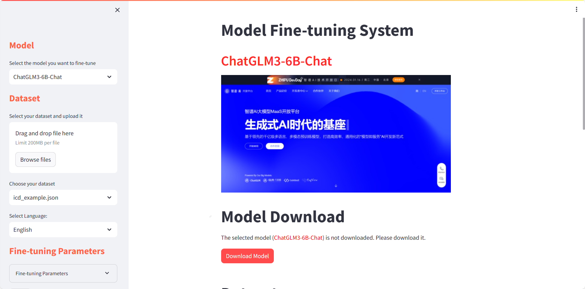
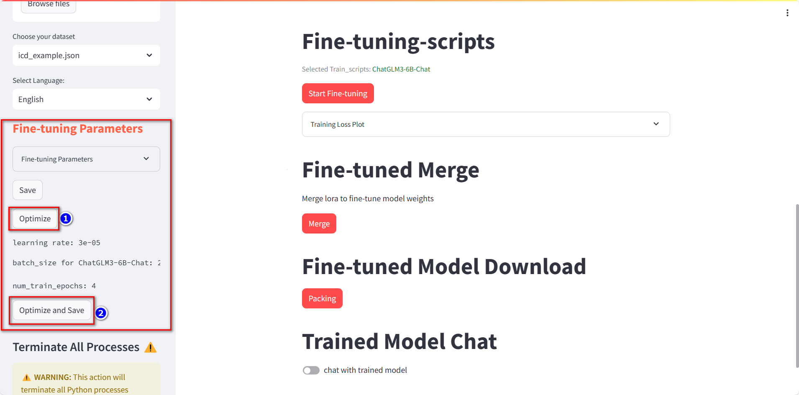

# LinChance-Fine-tuning-System  

**Read this in other languages: [English](README.md), [中文](README_zh.md).**

<!-- PROJECT LOGO -->
<br />

<p align="center">
  <a href="https://github.com/Joe-2002/LinChance-Fine-tuning-System/">
    
  </a>
  <p align="center">
    <br />
    <a href="https://github.com/Joe-2002/LinChance-Fine-tuning-System">View Demo</a>
    ·
    <a href="https://github.com/Joe-2002/LinChance-Fine-tuning-System/issues">Report Bug</a>
    ·
    <a href="https://github.com/Joe-2002/LinChance-Fine-tuning-System/issues">Request Feature</a>
  </p>
</p>

## Content

- [LinChance-Fine-tuning-System](#linchance-fine-tuning-system)
  - [Content](#content)
    - [Project Introduction](#project-introduction)
    - [Environment Setup](#environment-setup)
    - [**Installation Steps**](#installation-steps)
      - [1. Clone the Repository:](#1-clone-the-repository)
      - [2. Execute the following commands:](#2-execute-the-following-commands)
      - [3. Run the startup command:](#3-run-the-startup-command)
      - [4. ngrok Intranet Penetration](#4-ngrok-intranet-penetration)
      - [4. WandB Fine-tuning Output Information Network Charting](#4-wandb-fine-tuning-output-information-network-charting)
      - [5. Dataset Format](#5-dataset-format)
    - [Web UI Page Operations](#web-ui-page-operations)
      - [Click to Download Models](#click-to-download-models)
      - [Upload or Choose Existing Datasets](#upload-or-choose-existing-datasets)
      - [Start Fine-tuning with Default Script Parameters](#start-fine-tuning-with-default-script-parameters)
      - [Switch Between Chinese and English in Fine-tuning Parameter Information](#switch-between-chinese-and-english-in-fine-tuning-parameter-information)
      - [Automatically Optimize and Display Hyperparameters](#automatically-optimize-and-display-hyperparameters)
      - [Customize and Save Fine-tuning Script Parameters for Viewing and Starting Fine-tuning](#customize-and-save-fine-tuning-script-parameters-for-viewing-and-starting-fine-tuning)
      - [Resume Fine-tuning Progress](#resume-fine-tuning-progress)
      - [Display Loss Graph After Fine-tuning Completion](#display-loss-graph-after-fine-tuning-completion)
      - [Test the Trained Model with Dialogue](#test-the-trained-model-with-dialogue)
      - [Forceful Exit and Restart Button](#forceful-exit-and-restart-button)
    - [Supported Models](#supported-models)
  - [Likelihood Lab](#likelihood-lab)
  - [Contributors](#contributors)
  - [License](#license)

### Project Introduction  

- LinChance Fine-tuning System is a model fine-tuning web UI created using Streamlit combined with LLaMA-Factory in the `Autodl 3090 24G` experimental environment.
- It utilizes ngrok for intranet penetration to enable internet access to Autodl services.
- The system features a simple and elegant fine-tuning interface implemented using Streamlit components and methods. It incorporates the modelscope method for quick model downloads, allowing users to customize fine-tuning parameters. Users can choose existing datasets or upload private datasets for convenient and private fine-tuning using the Lora method. This design aims to provide a user-friendly experience, especially for beginners.
- The system employs Linux subprocess methods to run multiple Python processes for fine-tuning scripts and Streamlit Web UI. 

### Environment Setup

Rent a GPU machine with 24GB VRAM, such as a 3090 card, on the [autodl](https://www.autodl.com/) platform. Choose the following image: `PyTorch` --> `2.0.0` --> `3.8(ubuntu20.04)` --> `11.8`, as shown in the image below.


Next, open the `JupyterLab` on the rented server and open the terminal to start environment configuration, model downloads, and run the `demo`.

pip source replacement and dependency installation:

```shell
# Upgrade pip
python -m pip install --upgrade pip
# Change the pypi source to speed up library installation
pip config set global.index-url https://pypi.tuna.tsinghua.edu.cn/simple

pip install modelscope
```  

### **Installation Steps**

#### 1. Clone the Repository:

```sh
git clone https://github.com/Joe-2002/LinChance-Fine-tuning-System.git  
```  

#### 2. Execute the following commands:

```shell
cd /root/LinChance Fine-tuning System
pip install -r requirements.txt
```  

#### 3. Run the startup command:

```shell
python -m streamlit run main.py
```

#### 4. ngrok Intranet Penetration

1. First, check the installation command on the `Ngrok` official website. We'll use the example of a `Linux` system for installation, which can be done through various methods including downloading the compressed package, `APT` installation, and `Snap` installation. Here, we use `APT` installation, execute the following command:

    ```shell
    curl -s https://ngrok-agent.s3.amazonaws.com/ngrok.asc | sudo tee /etc/apt/trusted.gpg.d/ngrok.asc >/dev/null && echo "deb https://ngrok-agent.s3.amazonaws.com buster main" | sudo tee /etc/apt/sources.list.d/ngrok.list && sudo apt update && sudo apt install ngrok
    ```

2. After `Ngrok` is installed, register an account on its official website. Then, obtain the `Authtoken` in the `Your Authtoken` menu. This `Authtoken` is used for user identity verification. Set the `Authtoken` locally with the following command:

    ```shell
    ngrok config add-authtoken your-ngrok-authtoken # Replace this with your Authtoken
    ```

3. Next, execute the following command to proxy the local `Streamlit` service through `Ngrok`.

    ```shell
    ngrok http 8501 # streamlit default port is 8501
    ```

4. Access the link shown in the image below to open the `Web UI` page:

    

#### 4. WandB Fine-tuning Output Information Network Charting

1. Install WandB using the following command:

    ```bash
    pip install wandb
    ```

2. Once the installation is complete, you can access the WandB Quickstart guide at the following link: [WandB Quickstart](https://wandb.ai/quickstart)

3. Register an account on the WandB official website and obtain the API key for that account. Then, execute the following command in the terminal:

    ```bash
    wandb login
    ```

#### 5. Dataset Format

  *By default, the lima dataset is selected. After uploading a dataset, change its name to lima (since this repository is developed based on LlaMa Factory, the modified name can be directly recognized and used).*

```json
[
  {
    "instruction": "",
    "input": "",
    "output": "",
    "history": ""
  },
  {
    "instruction": "",
    "input": "",
    "output": "",
    "history": ""
  },
]
```  

### Web UI Page Operations  

#### Click to Download Models  

  

#### Upload or Choose Existing Datasets  

  

#### Start Fine-tuning with Default Script Parameters  


#### Switch Between Chinese and English in Fine-tuning Parameter Information

  

#### Automatically Optimize and Display Hyperparameters



#### Customize and Save Fine-tuning Script Parameters for Viewing and Starting Fine-tuning


#### Resume Fine-tuning Progress


#### Display Loss Graph After Fine-tuning Completion

  

#### Test the Trained Model with Dialogue  


#### Forceful Exit and Restart Button  

> Before usage, please read the warning message. Use with caution!!!


### Supported Models  

- [ChatGLM3](https://github.com/THUDM/ChatGLM3.git)
  - [x] ChatGLM3-6B-chat
- [Baichuan2](https://www.baichuan-ai.com/home)
  - [x] Baichuan2-7B-chat
  - [x] Baichuan2-13B-chat
- [Mistral](https://mistral.ai/news/announcing-mistral-7b/)
  - [x] Mistral-7B-v 0.1
- [Llama2](https://ai.meta.com/llama/)
  - [x] LlaMa2-7B-chat  
  
## [Likelihood Lab](http://www.maxlikelihood.cn/)

**Likelihood Lab** is a public AI lab initiated by *Maxwell (Mingwen) Liu*, the general manager of *Guangzhou Shining Midas Investment Management Co. Ltd.* and AI leader of *Revenco Conglomerate*. The main research fields are *FinTech, Energy, and Robotics*. Other co-founders of the lab include *Andrew Chen* from MIT, *Elvis Zhang* from Stanford, *Xingyu Fu* from the School of Mathematics SYSU, *Tanli Zuo* from the School of Computer Science SYSU.


## Contributors

[**Kechen Li**](https://github.com/Joe-2002)

Contact Email: <a href="mailto:likechen@linchance.com">likechen@linchance.com</a>

Affiliation: <a href="http://maxlikelihood.cn/">Likelihood Lab</a>

<div align="center">
  
  <br>
  <a href="https://github.com/Joe-2002"><b>Kechen Li</b></a>
  <p></p>
</div>

## License